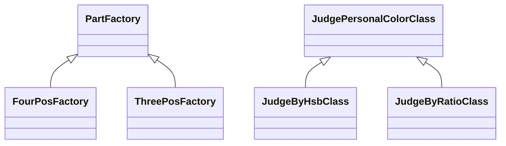
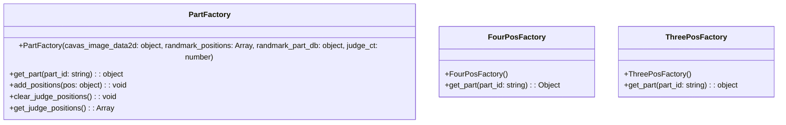
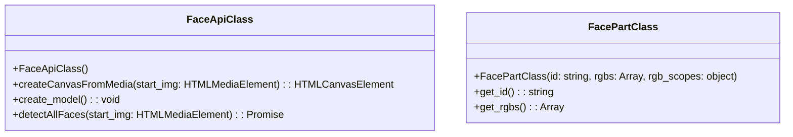
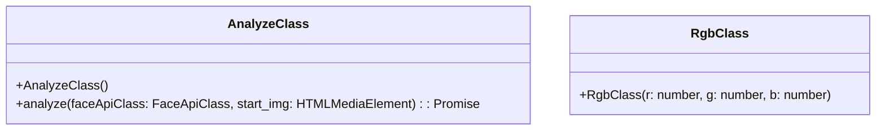

# Factory



# Judge

```mermaid
classDiagram


class JudgeFaceClass {
  +JudgeFaceClass(randmark_positions: Array<object>, width: number, height: number, scope_db: object)
  +get_judge_result(part: string): string
  +get_judge_score(part: string): number
  +judge_personal_color(part_id: string, factory: object): void
}

class JudgeFaceGuiClass {
  +JudgeFaceGuiClass()
  +boot_gui(): void
  +display_result(id: string, result_hoho: string, result_hoho_score: object): void
  +drow_judge_position(base_canvas: HTMLCanvasElement, detection: object, judge_positions: Array): void
  +photograph(): void
  +shutter(): void
}

class JudgeFaceStateClass {
  +JudgeFaceStateClass(items_tableopt:  object )
  +to_init(): void
  +to_photograph(): void
  +to_result(): void
  +to_selected(): void
}

# Judge Method
```mermaid
classDiagram

class JudgePersonalColorClass {
  +JudgePersonalColorClass

  (arg_part: object, part_scope_db: object)
  +get_scores(): object
}


class JudgeByHsbClass {
  +JudgeByHsbClass()
  +get_scores(): Object
}

class JudgeByRatioClass {
  +JudgeByRatioClass()
  +get_scores(): Object
}


```


```

# Face



# Else

