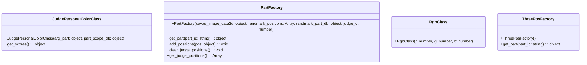

```mermaid
classDiagram


class JudgeFaceStateClass {
  +JudgeFaceStateClass(items_tableopt: { Items_table: object })
  +to_init(): void
  +to_photograph(): void
  +to_result(): void
  +to_selected(): void
}

```





AnalyzeClass --|> FaceApiClass
FaceApiClass --|> FacePartClass
FacePartClass --|> FourPosFactory
FourPosFactory --|> JudgeByHsbClass
JudgeByHsbClass --|> JudgeByRatioClass
JudgeByRatioClass --|> JudgeFaceClass
JudgeFaceClass --|> JudgeFaceGuiClass
JudgeFaceClass --|> JudgeFaceStateClass
JudgeFaceClass --|> JudgePersonalColorClass
JudgeFaceClass --|> PartFactory
PartFactory --|> RgbClass
ThreePosFactory --|> PartFactory
